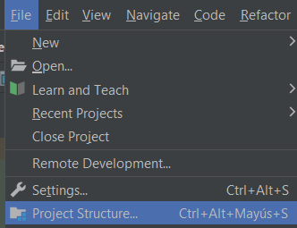
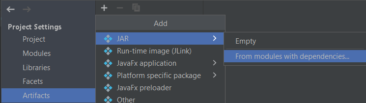
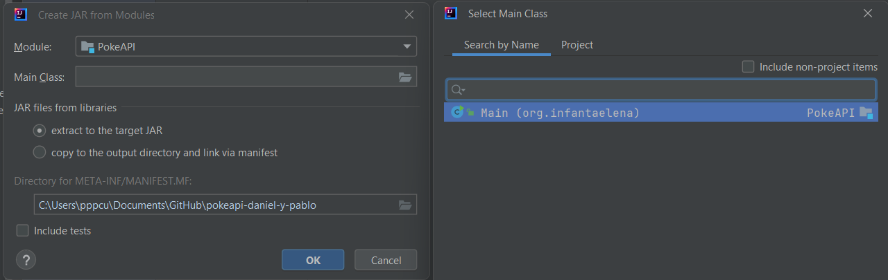
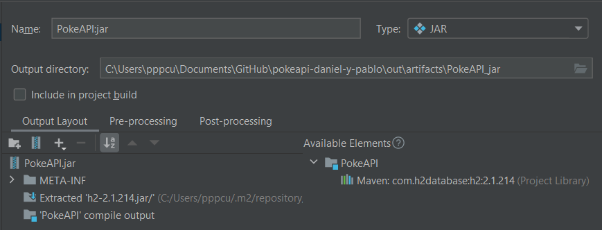
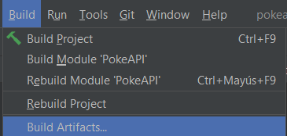
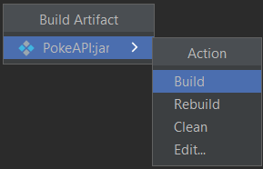
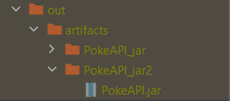

# Proyecto POKEAPI

## Componentes del grupo
Daniel Ocaña , Marcos Manzano, Pablo Polo

## IDE
IntelliJ Idea

## Versión JDK
Versión JDK 11

## Funcionamiento APP
Aplicación creada para añadir, eliminar, modificar y seleccionar unos pokemons que decida un usuario

## Generar el ejecutable
Se puede generar el ejecutable desde el propio IDE

En la pestaña file se selecciona la opción Project structure, y se mostrará una ventana emergente

En la nueva ventana seleccionamos la pestaña artifacts, donde añadiremos un nuevo archivo de tipo JAR

Se nos presenta una nueva ventana, donde seleccionamos como clase principal el "Main" tal y como se indica en la siguiente captura

Una vez elegida la clase, en la pantalla donde previamente le habíamos dado a añadir un artifact se nos muestra, el nombre del archivo jar y la ubicación donde se encuentra.

Después tenemos que compilar el artifact para que se guarde dicha compilación y se genere el archivo .jar, 
para ello nos vamos a la pestaña "Build" y pulsamos en "Build Artifacts..." 

Una vez hecho esto elejimos el jar de antes y pulsamos en "Build"

Una vez hecho se genera el jar en la carpeta de "out" y podemos moverlo a donde queramos

