# Proyecto POKEAPI

## Componentes del grupo
Daniel Ocaña , Marcos Manzano, Pablo Polo

## IDE
IntelliJ Idea

## Versión JDK
Versión JDK 11

## Funcionamiento APP
Aplicación creada para añadir, eliminar, modificar y seleccionar unos pokemons que decida un usuario.
El proyecto viene junto con un ejecutable del programa, aunque si por alguna razón, deseas generarlo tú mismo,
se explicará más adelante cómo hacerlo.

Cuando abramos el programa se nos presentará esta ventana

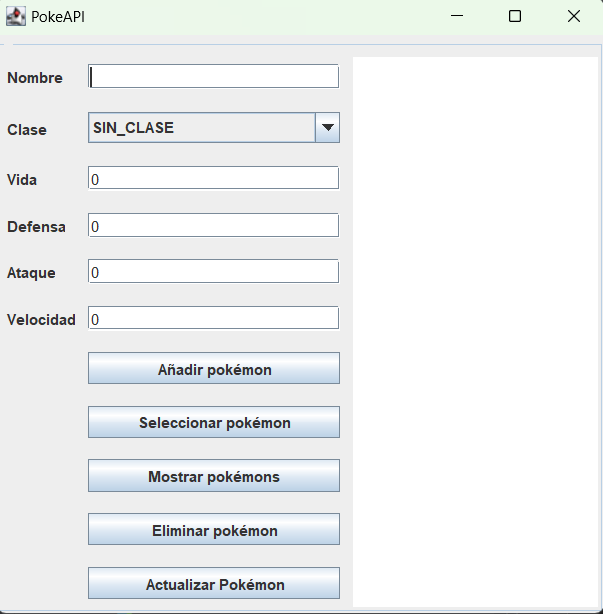

El primer botón, nos permite añadir un nuevo pokemon a nuestra base de datos, para ello tenemos que 
asegurarnos de que el nombre no esté vacío, de que tenga una clase y de que los valores "Vida", "Defensa","Ataque" y "Velocidad" sean númericos y estén dentro del ranto (entre 0 y 50),
de lo contrario se nos mostrará este error.

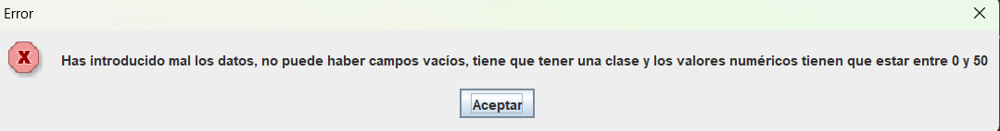

Si intentamos meter un pokémon que ya existe en la base de datos (el nombre), se nos mostrará este error.

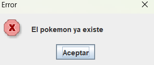

Si todas las operaciones se hacen correctamente, se nos informará de ello.

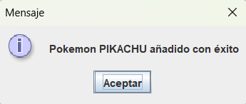

Una vez añadido el pokémon si en el campo "nombre" ponemos el pokémon que hemos añadido, si pulsamos en el botón "Seleccionar pokémon"
el resto de campos cambiarán automáticamete a los datos que hemos introducido previamente

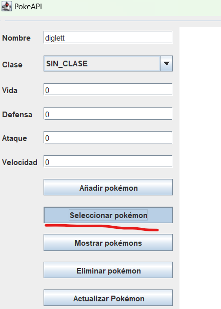

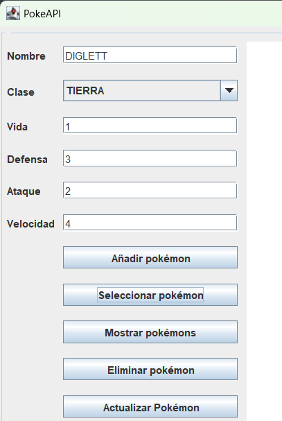

Básicamente, esto nos puede servir para actualizar datos y pulsar en el botón "Actualizar", si hemos introducido incorrectamente los datos,
se nos mostrará el mismo error de antes.

En el caso de que el pokémon no se encuentre en la base de datos, se nos presentará este error.

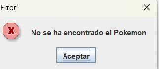

Si queremos visualizar todos los pokemons que hemos creado en nuestra base de datos, debemos elegir el botón "Mostrar pokemons",
y para ello además debemos marcar la clase como "SIN CLASE".

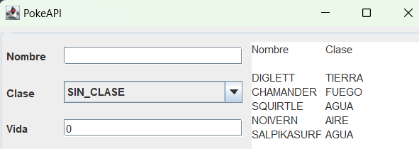

Si queremos visualizar solo un tipo de pokemons en concreto, debemos introducir en la pestaña "Clase", la que queremos visualizar.

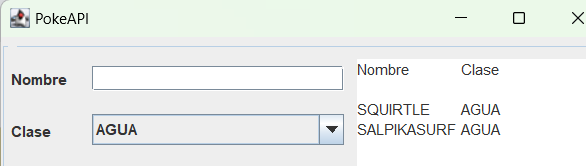

Si no hay ningún pokémon, ya sea en la base de datos entera, o filtrando por clase, se nos mostrará este mensaje.

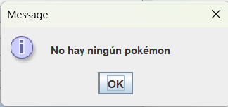

El último botón, es el de "eliminar los pokemons". Símplemente bastaría con escribir el nombre del pokémon y si lo encuentra en la base de datos, se nos presentará
una ventana para confirmar que queremos eliminarlo.

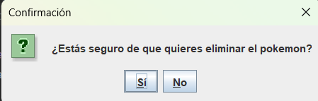

Y si seleccionamos "si", se nos informará de que se ha eliminado el pokémon correctamente

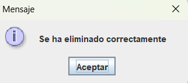

En el caso de que el pokémon no se encuentre en la base de datos, se nos presentará este error.

## Generar el ejecutable
Se puede generar el ejecutable desde el propio IDE

En la pestaña file se selecciona la opción Project structure, y se mostrará una ventana emergente

En la nueva ventana seleccionamos la pestaña artifacts, donde añadiremos un nuevo archivo de tipo JAR

Se nos presenta una nueva ventana, donde seleccionamos como clase principal el "Main" tal y como se indica en la siguiente captura

Una vez elegida la clase, en la pantalla donde previamente le habíamos dado a añadir un artifact se nos muestra, el nombre del archivo jar y la ubicación donde se encuentra.

Después tenemos que compilar el artifact para que se guarde dicha compilación y se genere el archivo .jar, 
para ello nos vamos a la pestaña "Build" y pulsamos en "Build Artifacts..." 

Una vez hecho esto elejimos el jar de antes y pulsamos en "Build"

Una vez hecho se genera el jar en la carpeta de "out" y podemos moverlo a donde queramos

